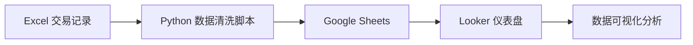

# HermitongDashboard 部署安装手册

> [!NOTE]
> 本手册适用于零基础用户,将详细指导您完成从环境配置到数据分析的全流程部署。

## 📋 目录

1. [系统概述](#系统概述)
2. [前置准备](#前置准备)
3. [环境配置](#环境配置)
4. [Google Cloud 配置](#google-cloud-配置)
5. [Python 脚本配置](#python-脚本配置)
6. [运行数据处理](#运行数据处理)
7. [Looker 仪表盘配置](#looker-仪表盘配置)
8. [日常使用](#日常使用)
9. [常见问题](#常见问题)

---

## 系统概述

### 系统架构

本系统是一个自动化交易数据分析平台,工作流程如下:



### 核心功能

- **自动数据清洗**: 从 Excel 文件中提取交易记录,自动解析股票和期权数据
- **FIFO 计算**: 采用先进先出算法计算持仓和已平仓盈亏
- **增量更新**: 只处理新增文件,避免重复处理
- **数据可视化**: 通过 Looker 创建专业的交易分析仪表盘

### 数据流说明

1. **数据源**: 长桥证券导出的 Excel 交易记录文件
2. **数据处理**: Python 脚本自动清洗、转换、计算
3. **数据存储**: Google Sheets 作为数据仓库
4. **数据展示**: Looker 连接 Google Sheets 进行可视化分析

---

## 前置准备

### 硬件要求

- 电脑系统: macOS / Windows / Linux
- 内存: 至少 4GB RAM
- 硬盘: 至少 1GB 可用空间

### 软件要求

- Python 3.7 或更高版本
- 稳定的网络连接
- Google 账号
- 浏览器 (推荐 Chrome)

### 需要准备的材料

- [ ] 长桥证券账号
- [ ] 交易记录 Excel 文件 (从长桥证券导出)
- [ ] Google 账号
- [ ] 约 30-60 分钟的配置时间

---

## 环境配置

### 步骤 1: 安装 Python

#### macOS 用户

1. 打开终端 (Terminal)
2. 检查是否已安装 Python:
   ```bash
   python3 --version
   ```
3. 如果未安装,访问 [Python 官网](https://www.python.org/downloads/) 下载安装

#### Windows 用户

1. 访问 [Python 官网](https://www.python.org/downloads/)
2. 下载 Windows 安装包
3. 运行安装程序,**务必勾选 "Add Python to PATH"**
4. 打开命令提示符 (CMD),验证安装:
   ```bash
   python --version
   ```

### 步骤 2: 下载项目代码

#### 方式一: 使用 Git (推荐)

```bash
# 克隆项目到本地
git clone <你的项目仓库地址>
cd HermitongDashboard
```

#### 方式二: 直接下载

1. 从 GitHub 下载 ZIP 压缩包
2. 解压到合适的位置
3. 记住项目路径,后续会用到

### 步骤 3: 安装 Python 依赖包

打开终端/命令提示符,进入项目目录:

```bash
cd /Users/edwin/Desktop/Study/HermitongDashboard(Google)
```

安装所需的 Python 包:

```bash
pip3 install pandas gspread numpy openpyxl
```

> [!TIP]
> 如果安装速度慢,可以使用国内镜像源:
> ```bash
> pip3 install -i https://pypi.tuna.tsinghua.edu.cn/simple pandas gspread numpy openpyxl
> ```

---

## Google Cloud 配置

### 步骤 1: 创建 Google Cloud 项目

1. 访问 [Google Cloud Console](https://console.cloud.google.com/)
2. 点击顶部的项目下拉菜单
3. 点击 **"新建项目"**
4. 输入项目名称,例如: `HermitongDashboard`
5. 点击 **"创建"**

### 步骤 2: 启用 Google Sheets API

1. 在 Google Cloud Console 中,点击左侧菜单 **"API 和服务"** → **"库"**
2. 搜索 `Google Sheets API`
3. 点击进入,点击 **"启用"**

### 步骤 3: 创建服务账号

1. 点击左侧菜单 **"API 和服务"** → **"凭据"**
2. 点击 **"创建凭据"** → **"服务账号"**
3. 填写服务账号信息:
   - **服务账号名称**: `hermitongdashboard`
   - **服务账号 ID**: 自动生成
   - **描述**: Trading Record Dashboard Service Account
4. 点击 **"创建并继续"**
5. 角色选择: **"编辑者"** (Editor)
6. 点击 **"完成"**

### 步骤 4: 生成密钥文件

1. 在凭据页面,找到刚创建的服务账号
2. 点击服务账号邮箱进入详情页
3. 切换到 **"密钥"** 标签
4. 点击 **"添加密钥"** → **"创建新密钥"**
5. 选择 **JSON** 格式
6. 点击 **"创建"**,密钥文件会自动下载

> [!IMPORTANT]
> 将下载的 JSON 文件重命名为 `credentials.json`,并放到项目根目录下。
> 这个文件包含敏感信息,**切勿上传到 GitHub 或分享给他人**!

### 步骤 5: 创建 Google Sheet

1. 访问 [Google Sheets](https://sheets.google.com/)
2. 点击 **"空白"** 创建新表格
3. 将表格重命名为: `HermitongDashboard`
4. 复制服务账号邮箱地址 (在 `credentials.json` 中的 `client_email` 字段)
   - 格式类似: `hermitongdashboard@tradingrecord.iam.gserviceaccount.com`
5. 点击 Google Sheet 右上角的 **"共享"** 按钮
6. 粘贴服务账号邮箱,权限设置为 **"编辑者"**
7. 点击 **"发送"**

> [!WARNING]
> 如果不共享给服务账号,脚本将无法访问 Google Sheet!

---

## Python 脚本配置

### 步骤 1: 检查配置文件

打开 [process_files.py](file:///Users/edwin/Desktop/Study/HermitongDashboard(Google)/process_files.py) 文件,检查以下配置:

```python
# --- 1. 配置区域 ---
SOURCE_FOLDER_PATH = '/Users/edwin/Desktop/Study/HermitongDashboard(Google)/TradeRecord' 
GOOGLE_SHEET_NAME = 'HermitongDashboard' 
CREDENTIALS_FILE = 'credentials.json'
PROCESSED_FILES_LOG = 'processed_files.txt'
```

### 步骤 2: 修改路径配置

根据你的实际情况修改 `SOURCE_FOLDER_PATH`:

- **macOS 示例**: `/Users/你的用户名/Documents/HermitongDashboard/TradeRecord`
- **Windows 示例**: `C:/Users/你的用户名/Documents/HermitongDashboard/TradeRecord`

> [!TIP]
> 获取文件夹路径的方法:
> - **macOS**: 在 Finder 中右键文件夹,按住 Option 键,选择 "拷贝路径名称"
> - **Windows**: 在文件资源管理器中,按住 Shift 右键文件夹,选择 "复制为路径"

### 步骤 3: 准备交易记录文件

#### 从长桥证券下载交易记录

本系统专门为**长桥证券**(Longbridge)的交易数据设计。请按以下步骤下载交易记录:

1. **登录长桥证券电脑端**
   - 打开长桥证券客户端并登录

2. **导出历史订单**
   - 点击 **"资产"**
   - 选择 **"历史订单"**
   - 点击 **"导出"** 按钮
   - **重要**: 勾选 **"包含订单明细"** 选项
   - 选择导出时间范围
   - 点击确认导出

3. **保存文件**
   - 将下载的 Excel 文件保存到项目的 `TradeRecord` 文件夹中
   - 文件名格式通常为: `History_Orders-YYYY-MM-DD_HH_MM_SS.xlsx`

> [!TIP]
> 建议定期(如每周或每月)导出一次交易记录,系统会自动识别并处理新文件。

#### Excel 文件要求

长桥证券导出的文件应包含以下列:
- `Order Status`: 订单状态 (必须包含 "已成交" 状态)
- `Symbol`: 股票/期权代码
- `Direction`: 买卖方向 (Buy/Sell)
- `Order Qty`: 订单数量
- `Avg Price`: 平均成交价格
- `Order Time`: 订单时间

> [!NOTE]
> 如果您使用的是其他券商,可能需要修改脚本中的列名映射。详见[常见问题 Q8](#q8-支持哪些券商的数据格式)。

---

## 运行数据处理

### 首次运行

1. 打开终端/命令提示符
2. 进入项目目录:
   ```bash
   cd /Users/edwin/Desktop/Study/HermitongDashboard(Google)
   ```
3. 运行脚本:
   ```bash
   python3 process_files.py
   ```

### 运行结果说明

成功运行后,你会看到类似的输出:

```
--- 脚本开始运行: 2025-12-14 10:50:21 ---
从Sheet读取到 0 条 '所有交易数据' 记录。
从Sheet读取到 0 条 '持仓中' 记录。
从Sheet读取到 0 条 '已平仓' 记录。
发现 3 个新的Excel文件
从新文件中解析到 245 条新记录。
开始合并与数据校验...
去重后,总计有效记录: 245 条。
开始执行FIFO计算...
'所有交易数据' 更新成功!
'持仓中' 更新成功!
'已平仓' 更新成功!
标记 3 个新文件为已处理。
--- 脚本运行结束 ---
```

### 验证数据上传

1. 打开你的 [Google Sheet](https://sheets.google.com/)
2. 找到 `HermitongDashboard` 表格
3. 检查是否生成了三个工作表:
   - **所有交易数据**: 所有交易记录的原始数据
   - **持仓中**: 当前持有的仓位
   - **已平仓**: 已经平仓的交易及盈亏统计

---

## Looker 仪表盘配置

### 步骤 1: 访问 Looker Studio

1. 访问 [Looker Studio](https://lookerstudio.google.com/)
2. 使用你的 Google 账号登录

### 步骤 2: 创建数据源

1. 点击 **"创建"** → **"数据源"**
2. 在连接器列表中选择 **"Google Sheets"**
3. 选择你的 `HermitongDashboard` 表格
4. 选择 **"已平仓"** 工作表
5. 点击右上角 **"连接"**
6. 检查字段类型是否正确:
   - 数值字段: `平仓数量`, `买入价格`, `卖出价格`, `已实现盈亏`, `收益率`, `持仓天数`
   - 日期字段: `买入时间`, `平仓时间`
   - 文本字段: `资产类型`, `资产代码`, `标的方向`
7. 点击 **"创建报表"**

### 步骤 3: 设计仪表盘

#### 添加关键指标卡片

1. **总盈亏**:
   - 点击工具栏 **"添加图表"** → **"记分卡"**
   - 指标: `已实现盈亏` (SUM)
   - 样式: 设置字体大小、颜色

2. **胜率**:
   - 添加记分卡
   - 指标: `胜负` (AVG)
   - 格式: 百分比

3. **交易次数**:
   - 添加记分卡
   - 指标: `资产代码` (COUNT)

#### 添加时间序列图表

1. 点击 **"添加图表"** → **"时间序列图表"**
2. 维度: `平仓时间`
3. 指标: `已实现盈亏` (SUM)
4. 可选: 添加 `累计盈亏` 作为第二条线

#### 添加分类分析

1. **按资产类型分析**:
   - 图表类型: 饼图
   - 维度: `资产类型`
   - 指标: `已实现盈亏` (SUM)

2. **按股票代码分析**:
   - 图表类型: 柱状图
   - 维度: `资产代码`
   - 指标: `已实现盈亏` (SUM)
   - 排序: 按盈亏降序

#### 添加详细数据表

1. 点击 **"添加图表"** → **"表格"**
2. 维度: `平仓时间`, `资产代码`, `标的方向`
3. 指标: `平仓数量`, `买入价格`, `卖出价格`, `已实现盈亏`, `收益率`
4. 启用分页和排序功能

### 步骤 4: 添加筛选器

1. 点击 **"添加控件"** → **"日期范围控件"**
2. 默认日期范围: 最近 30 天
3. 添加下拉筛选器:
   - `资产类型`
   - `资产代码`

### 步骤 5: 美化仪表盘

1. **主题设置**:
   - 点击 **"主题和布局"**
   - 选择合适的主题或自定义颜色

2. **布局优化**:
   - 将关键指标卡片放在顶部
   - 图表按重要性排列
   - 详细数据表放在底部

3. **添加标题和说明**:
   - 点击 **"插入"** → **"文本"**
   - 添加仪表盘标题和使用说明

### 参考仪表盘示例

根据您上传的图片,您可以创建类似的仪表盘布局:


**关键指标区域** (顶部):
- 期权交易次数、期权单笔盈利、期权胜率
- 股票交易次数、股票单笔盈利、股票胜率
- FIRE 进展 (总盈亏)

**图表区域** (中部):
- 交易时间戳趋势图
- 盈亏日柱状图
- 已实现盈亏随时间变化
- 期权方向盈利分析

---

## 日常使用

### 添加新的交易记录

1. **从长桥证券导出新的交易记录**
   - 打开长桥证券电脑端
   - 点击 **"资产"** → **"历史订单"** → **"导出"**
   - 勾选 **"包含订单明细"**
   - 导出并保存到 `TradeRecord` 文件夹

2. **运行处理脚本**
   ```bash
   python3 process_files.py
   ```

3. **验证结果**
   - 脚本会自动识别新文件并处理
   - 检查 Google Sheet 中的数据是否更新
   - 刷新 Looker 仪表盘查看最新数据

### 自动化运行 (可选)

#### macOS / Linux 使用 cron

1. 打开终端,编辑 crontab:
   ```bash
   crontab -e
   ```
2. 添加定时任务 (每天早上 8 点运行):
   ```
   0 8 * * * cd /Users/edwin/Desktop/Study/HermitongDashboard(Google) && /usr/bin/python3 process_files.py >> /tmp/hermitong.log 2>&1
   ```
3. 保存退出

#### Windows 使用任务计划程序

1. 打开 **"任务计划程序"**
2. 点击 **"创建基本任务"**
3. 设置触发器: 每天特定时间
4. 操作: 启动程序
   - 程序: `python`
   - 参数: `process_files.py`
   - 起始于: 项目目录路径
5. 完成创建

### 手动输入补充信息

脚本支持在 Google Sheet 中手动添加以下信息,再次运行脚本时会保留:

**持仓中工作表**:
- `消息来源`: 记录交易信号来源

**已平仓工作表**:
- `消息来源`: 记录交易信号来源
- `平仓理由`: 记录平仓原因

> [!TIP]
> 手动输入的数据会在下次运行脚本时自动合并保留,不会丢失。

---

## 常见问题

### Q1: 运行脚本时提示 "连接Google Sheets失败"

**可能原因**:
- `credentials.json` 文件不存在或路径错误
- Google Sheets API 未启用
- 服务账号权限不足

**解决方法**:
1. 检查 `credentials.json` 是否在项目根目录
2. 确认已启用 Google Sheets API
3. 确认 Google Sheet 已共享给服务账号

### Q2: 脚本运行成功但 Google Sheet 中没有数据

**可能原因**:
- Excel 文件中没有 "已成交" 状态的订单
- Excel 文件格式不正确

**解决方法**:
1. 检查 Excel 文件中 `Order Status` 列是否包含 "已成交"
2. 确认 Excel 文件包含所有必需的列
3. 查看脚本输出日志,确认解析到的记录数

### Q3: 如何处理期权数据?

脚本会自动解析期权代码,格式示例:
- `AAPL251217C00150000` 解析为:
  - 股票: AAPL
  - 到期日: 2025年12月17日
  - 方向: Call
  - 行权价: $150

### Q4: 数据重复怎么办?

脚本内置了去重机制,基于以下字段:
- 交易时间戳
- 资产类型
- 股票代码
- 方向
- 数量
- 价格
- 期权信息

重复数据会自动过滤,不会影响结果。

### Q5: 如何备份数据?

**方法一: Google Sheet 自动备份**
- Google Sheet 自带版本历史功能
- 点击 **"文件"** → **"版本历史记录"** 查看

**方法二: 导出备份**
- 在 Google Sheet 中点击 **"文件"** → **"下载"** → **"Excel (.xlsx)"**
- 定期导出保存到本地

### Q6: Looker 仪表盘数据不更新?

**解决方法**:
1. 点击 Looker 右上角的 **"刷新数据"** 按钮
2. 检查数据源连接是否正常
3. 确认 Google Sheet 中的数据已更新

### Q7: 如何修改 FIFO 计算逻辑?

FIFO (先进先出) 计算逻辑在 [process_files.py](file:///Users/edwin/Desktop/Study/HermitongDashboard(Google)/process_files.py#L68-L172) 的 `calculate_positions_fifo()` 函数中。

如需修改,建议:
1. 先备份原文件
2. 理解现有逻辑
3. 小范围测试修改
4. 验证计算结果

### Q8: 支持哪些券商的数据格式?

本系统专门为**长桥证券**(Longbridge)的数据格式设计和优化。

**长桥证券标准列名**:
- `Order Status`: 订单状态 ("已成交")
- `Symbol`: 股票/期权代码
- `Direction`: 买卖方向 (Buy/Sell)
- `Order Qty`: 订单数量
- `Avg Price`: 平均成交价格
- `Order Time`: 订单时间

**使用其他券商?**

如果您使用的是其他券商(如富途、老虎、盈透等),需要:
1. 检查导出文件的列名是否与上述标准一致
2. 如果不一致,需要修改 `process_files.py` 中的 `clean_and_transform_orders()` 函数
3. 调整列名映射以匹配您的券商格式

> [!WARNING]
> 不同券商的期权代码格式可能不同,如果您交易期权,请特别注意期权代码解析逻辑是否适用。

---

## 技术支持

### 查看日志

脚本运行时会输出详细日志,包括:
- 处理的文件数量
- 解析的记录数
- 去重后的记录数
- 上传状态

如遇问题,请保存完整的日志输出以便排查。

### 获取帮助

1. 查看 [CLAUDE.md](file:///Users/edwin/Desktop/Study/HermitongDashboard(Google)/CLAUDE.md) 了解项目架构
2. 检查 [process_files.py](file:///Users/edwin/Desktop/Study/HermitongDashboard(Google)/process_files.py) 中的注释
3. 在 GitHub Issues 中提问

---

## 附录

### 项目文件结构

```
HermitongDashboard(Google)/
├── TradeRecord/              # 交易记录文件夹
│   ├── History_Orders-2025-10-04.xlsx
│   ├── History_Orders-2025-10-08.xlsx
│   └── ...
├── process_files.py          # 主处理脚本
├── credentials.json          # Google 服务账号密钥 (敏感文件)
├── processed_files.txt       # 已处理文件日志
├── README.md                 # 项目说明
├── CLAUDE.md                 # 开发文档
└── 部署安装手册.md            # 本手册
```

### 数据字段说明

#### 所有交易数据

| 字段 | 说明 | 示例 |
|------|------|------|
| 交易时间戳 | 交易时间 | 2025-10-04T09:30:00 |
| 资产类型 | 股票或期权 | 期权 |
| Stock | 股票代码 | AAPL |
| 方向 | Buy/Sell | Buy |
| 数量 | 交易数量 | 100 |
| 价格 | 交易价格 | 150.50 |
| 行权日 | 期权到期日 | 251217 |
| 期权方向 | Call/Put | Call |
| 行权价 | 期权行权价 | 150.0 |

#### 持仓中

| 字段 | 说明 |
|------|------|
| 资产类型 | 股票或期权 |
| 资产代码 | 股票代码 |
| 持仓数量 | 当前持仓数量 |
| 平均成本 | 平均买入成本 |
| 开仓时间 | 首次买入时间 |
| 距离到期日的天数 | 期权剩余天数 |
| 期权信息 | 期权详细信息 |
| 消息来源 | 手动输入 |

#### 已平仓

| 字段 | 说明 |
|------|------|
| 资产类型 | 股票或期权 |
| 资产代码 | 股票代码 |
| 标的方向 | Buy Call/Buy Put 等 |
| 买入时间 | 买入时间 |
| 平仓时间 | 卖出时间 |
| 持仓天数 | 持有天数 |
| 平仓数量 | 平仓数量 |
| 买入价格 | 买入价格 |
| 卖出价格 | 卖出价格 |
| 已实现盈亏 | 盈亏金额 |
| 胜负 | 1=盈利, 0=亏损 |
| 收益率 | 收益率百分比 |
| 累计盈亏 | 累计盈亏金额 |
| 距离到期日的天数 | 买入时距到期天数 |
| 期权信息 | 期权详细信息 |
| 消息来源 | 手动输入 |
| 平仓理由 | 手动输入 |

### 更新日志

- **2025-12-14**: 创建初始版本
- 后续更新将记录在此

---

## 结语

恭喜你完成了 HermitongDashboard 的部署!

现在你可以:
- ✅ 自动处理交易记录
- ✅ 实时查看持仓和盈亏
- ✅ 通过 Looker 可视化分析交易表现

如有任何问题,请参考常见问题章节或寻求技术支持。

祝你交易顺利! 📈
